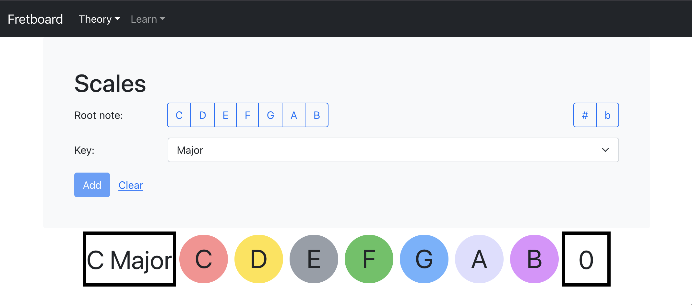
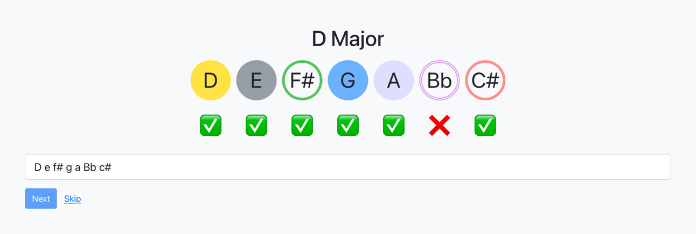

# fretboard
Fun project for learning music theory with python.

## Features:
1. Build a scale from an any note:
   * Major
   * Minor
   * Harmonic minor
   * Ascending and descending melodic minor
2. Practice learning scale notes

## Tech stack:
1. [Python 3.9](https://www.python.org/)
2. [Node 17.8.0](https://nodejs.org/en/)
3. [React](https://reactjs.org/) for Browser GUI
4. [FastAPI](https://fastapi.tiangolo.com) for REST API
5. [PyCharm](https://www.jetbrains.com/pycharm/) as IDE
6. [Docker](https://www.docker.com/) for containerization

## Development

### API server
1. Call `make install` to prepare dev environment. Use `make install-dev` for install dependencies (pytest, black, etc)
2. Run `make run-api` to start app

### Client
0. `cd client`
1. Call `make install` to prepare dev environment
2. `make run-client` to start app

## Production

Call `make spin-up` to start all in Docker in production mode
